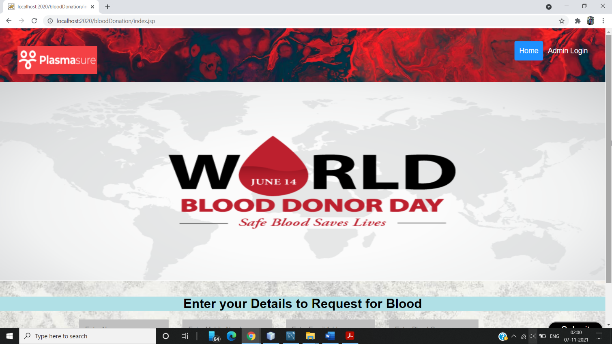
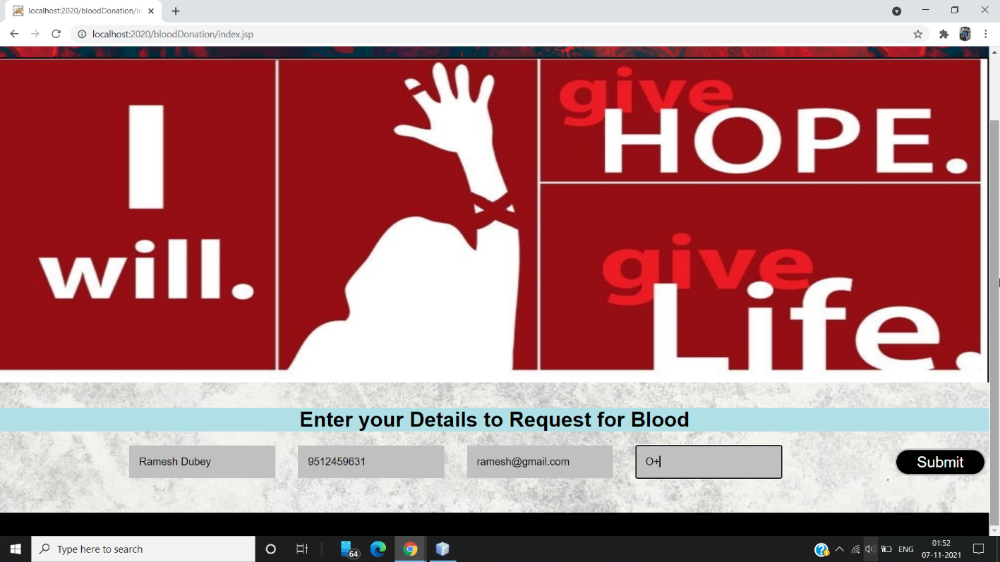
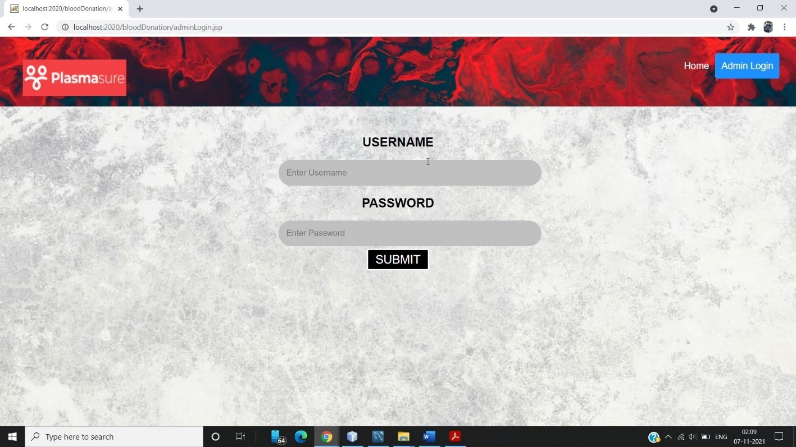
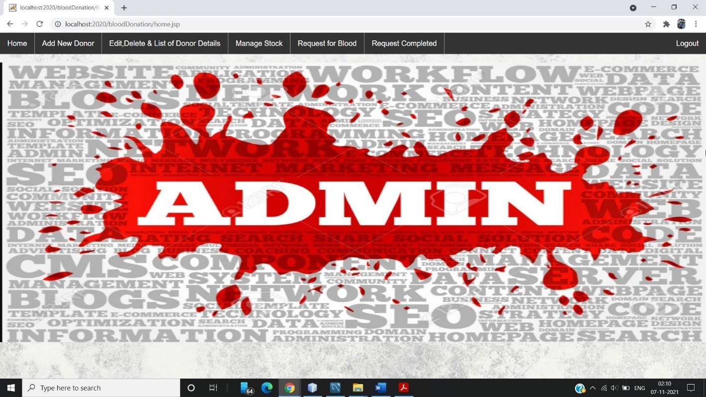
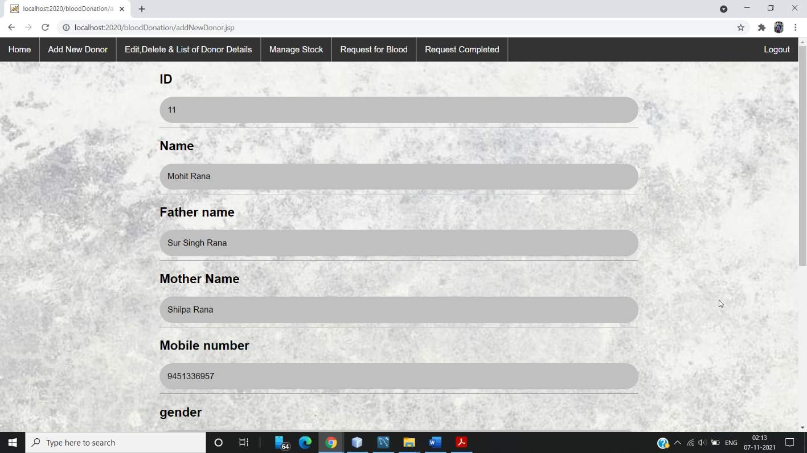
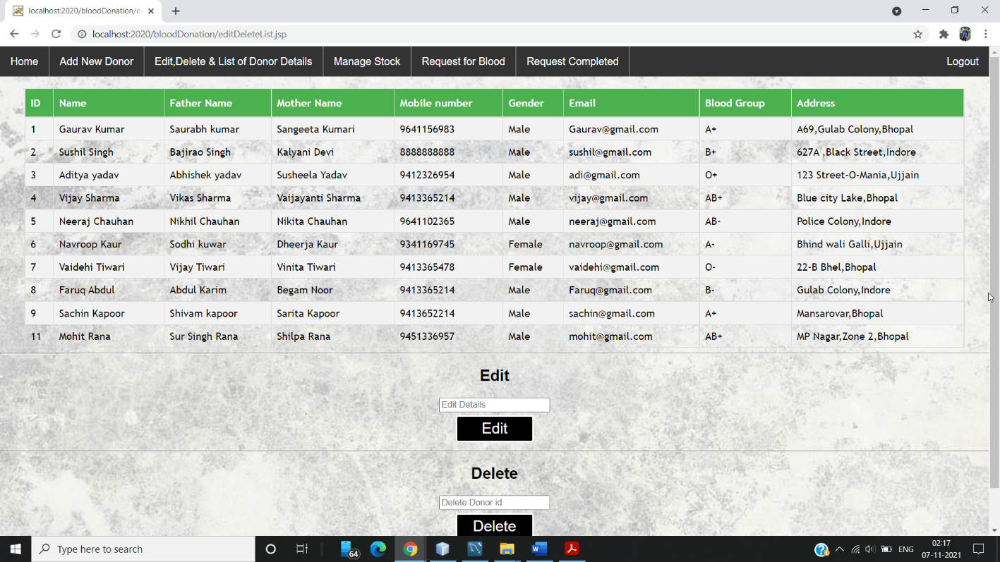
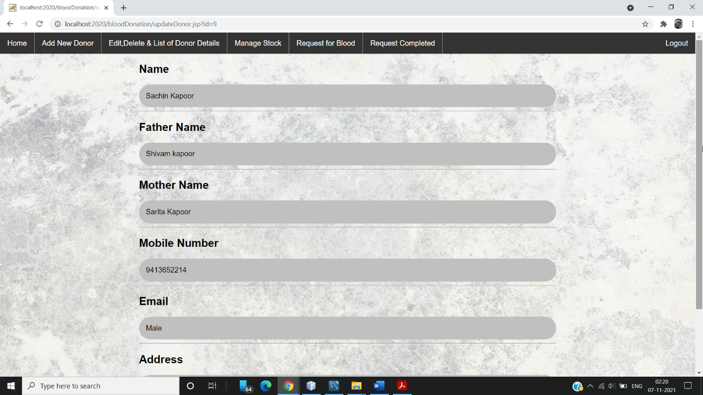
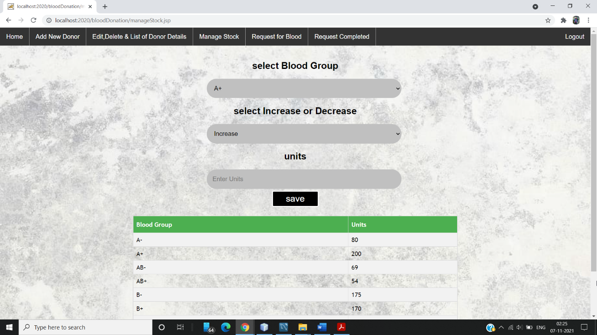
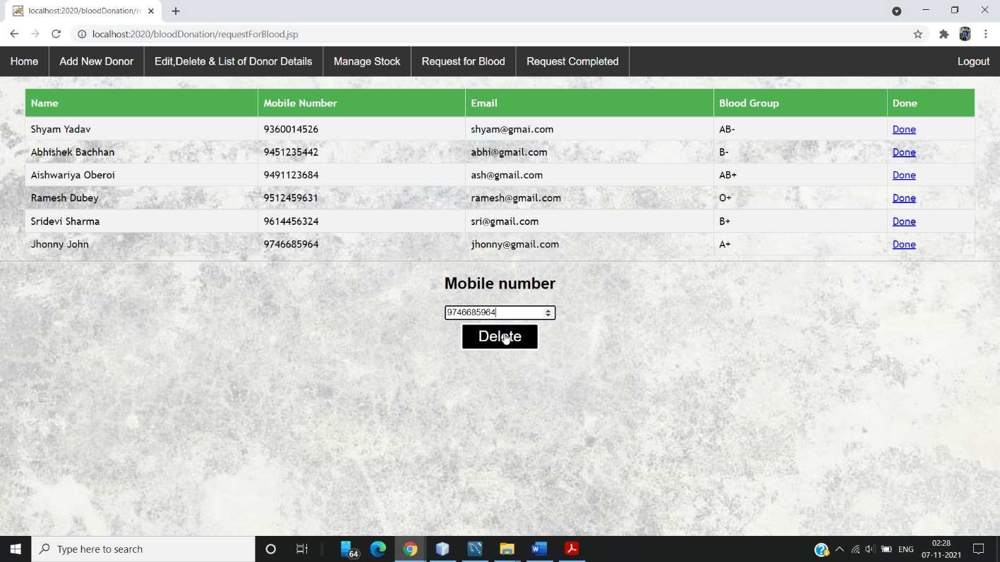
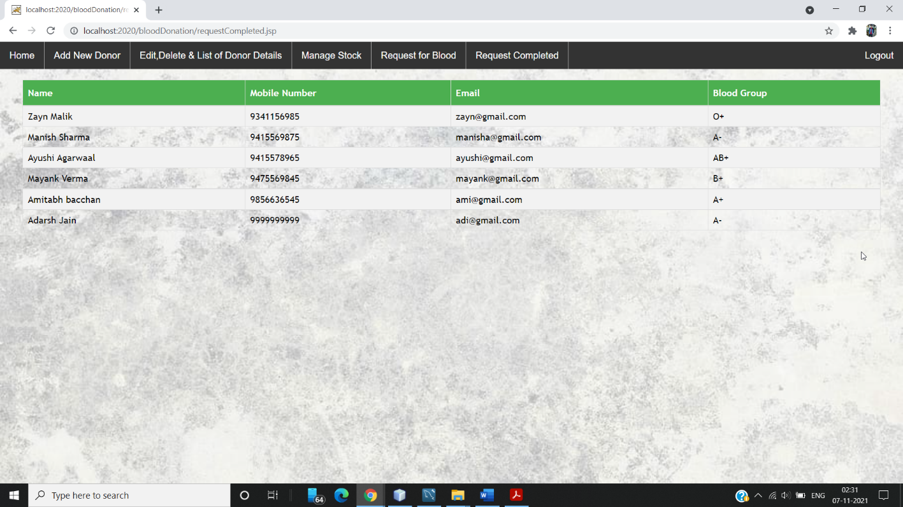

=============

:syringe: PlasmaSure  :ambulance:
=============
About The Application :page_facing_up:
-------------
The software system is an is a community based online platform that helps the COVID-19 patients seeking plasma by connecting them with plasma donors across India within 24 hours, in order to facilitate Convalescent Plasma Therapy (CPT) . The project consists of a central repository containing various plasma deposits available along with associated details. These details include blood type, storage area and date of storage. These details help in maintaining and monitoring the blood deposits. The system also has added features such as patient name and contacts, blood booking and even need for certain blood group is posted on the website to find available donors for a blood emergency.

### Tech Stack :computer:
-----------
**Frontend:** HTML, CSS, Javascript  :airplane:

**Backend	:** JSP, Servlet, JDBC, Java  :boat:

**Database:** MySQL  :tractor:

### Features :sparkles:  :rocket:
-------
- **Online Registration/Login:** The users that are in need of plasma and other covid
related medicines can register online and find their suitable donors online.
- **Donor registration:** Donors can also register in the system to post their donation
information.
- **Plasma Covid medicine requirement posting:** Already registered users can also
post their requirements need for blood or Injection like Remdesivir favipiravir, and
ivermectin
- **Donated plasma/medicine storage data and availability check:** The system
automatically stores the information as soon as there is any updating made.
- **Donor Finder:** The system automatically finds the donor information when there
arises any requirement.
- **Blood Finder :** The system also finds blood type required according to user's
- **Inventory management** in blood bank for storage and issuance of blood.
- Discarding of expired and unsuitable blood (Less Qty., Reactive, Clotting, Hemolysis).
- Being a web-based system, can be implemented throughout the state.
- Patient Register/Blood Sample Receiving Register, Donor Register ,Discarded donor.

### Goal :soccer: 
-----
Experiencing the helplessness and frustration of the COVID-19 patients and their relatives first-hand, a team consisting of doctors came up with an idea to create a platform that helps these patients and their relatives in finding a plasma donor quickly and effortlessly.

### The Challenge :fire:
-----
- The major challenge faced will be to filter out inappropriate or test seeking donors to reduce unnecessary burden on collection centres. The approved guidelines for registered clinical trials must be strictly followed.  
- To eradicate the fear and stigma associated with the therapy, in a majority of the population.

### The Solution :droplet:
-----
Creating an online platform that not just serves as a strong network between plasma donors and plasma seekers. But also acts as a platform to spread awareness and motivate donors by taking care of their plasma needs and safety.

## Screenshot :camera:
--------
>  Home Page  :dog:

> Request Form  :cat:

> Login Page  :elephant:

> Admin Home Page  :camel:

> Add New Donar Page  :panda_face:

> Donar Details  :octopus:

> Update Details  :whale2:

> Manage Stocks  :tiger2:

> Active Requests / Pending Requests  :crocodile:

> Completed Requests  :penguin:

